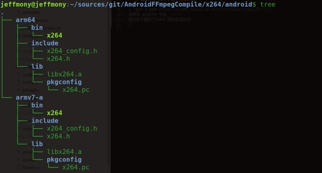

# AndroidFFmpegCompile
#### 编译Android 平台下的FFmpeg 库
1. git clone https://git.ffmpeg.org/ffmpeg.git<br>
 我已经下载好了ffmpeg 代码，并且切换到了 n4.0.3分支，可以直接使用，下面的步骤可以直接忽略，直接使用；
2. cd ffmpeg
3. git checkout -b local_n4.0.3 n4.0.3
4. 修改 configure 文件<br>
将configure中的几行配置修改一下
```
SLIBNAME_WITH_MAJOR='$(SLIBNAME).$(LIBMAJOR)
```
修改为
```
SLIBNAME_WITH_MAJOR='$(SLIBNAME)-$(LIBMAJOR)$(SLIBSUF)'
```
 将
```
SLIB_INSTALL_NAME='$(SLIBNAME_WITH_VERSION)'
SLIB_INSTALL_LINKS='$(SLIBNAME_WITH_MAJOR) $(SLIBNAME)'
```
修改为
```
SLIB_INSTALL_NAME='$(SLIBNAME_WITH_MAJOR)'
SLIB_INSTALL_LINKS='$(SLIBNAME)'
```
这是为了编译出的so是Android平台标准的so;
5. 设置NDK_ROOT
我本地下载的是android-ndk-r14b
我使用ubuntu 系统编译的;
6. cd ffmpeg 目录;
  执行 ./build_android_ffmpeg.sh all 可以编译所有平台的so<br>
  执行 ./build_android_ffmpeg.sh armv7 可以编译armeabi-v7a so<br>
  执行 ./build_android_ffmpeg.sh armv8 可以编译arm64-v8a so<br>

  执行完成后，在 ffmpeg/android/ 下面会生成两个文件夹，分别存放两个平台的库以及头文件;

#### 编译Android 平台下的x264库

1. git clone https://code.videolan.org/videolan/x264.git <br>
切换到 stable 分支; <br>
我已经下载好了x264 库在此项目中;
2. 编译完成之后，在x264/android 目录下生成如何的文件<br>
 
 <br>

#### 将x264 编译进FFmpeg 库
1. 将x264/android 文件夹拷贝到 ffmpeg/x264 文件夹下
2. 修改 ffmpeg 编译脚本<br>
  执行 ./build_android_ffmpeg_x264.sh all 可以编译所有平台的so<br>
  执行 ./build_android_ffmpeg_x264.sh armv7 可以编译armeabi-v7a so<br>
  执行 ./build_android_ffmpeg_x264.sh armv8 可以编译arm64-v8a so<br>

#### 编译openssl Android平台库

#### 将openssl 编译进FFmpeg 库
